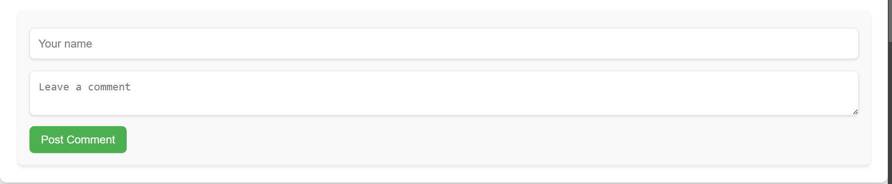

# My Blog Post Website

Welcome to my professional blog website, built as part of my work as a Full Stack Developer at Unified Mentor. This project showcases a responsive blog design, allowing users to navigate through blog posts, view detailed articles, and interact with content via a comment section.
## Opening Page


## Features

- **Responsive Design**: Adapts seamlessly to various screen sizes, ensuring a pleasant experience on desktops, tablets, and mobile devices.
- **Interactive Comment Section**: Enables users to engage with posts by leaving comments.
- **Organized Content Navigation**: Easily browse through blog topics using a top navigation menu.

## Technologies Used

- **HTML**: For structuring the website.
- **CSS**: To style and enhance the visual appeal.
- **JavaScript**: Adds interactivity and functionality.

### Screenshots

#### Blog Homepage


#### Blog Post


#### Comment Section



## How to Use

To explore the website locally:
1. Clone the repository:
   ```bash
   git clone https://github.com/sidhartha2403/MyBlogPostWebsite.git

2. Navigate to the Project Directory
   Once cloned, move into the project folder by running:

   bash: cd MyBlogPostWebsite

3. Open the Project in Your Code Editor
   Open this folder in your preferred code editor (e.g., VS Code) to view and edit the files.

4. View the Website Locally
   Open the index.html file in your browser. You can usually do this by right-clicking the file and selecting Open With > [Your Browser].

5. Interact with the Blog
   Use the top navigation menu to browse between sections, read blog posts, and try out the comment section.

6. Customizing Content

-> Update the blog content by editing the index.html file and adding/removing blog posts in the HTML structure.
->Style modifications can be done by adjusting the styles.css file.
